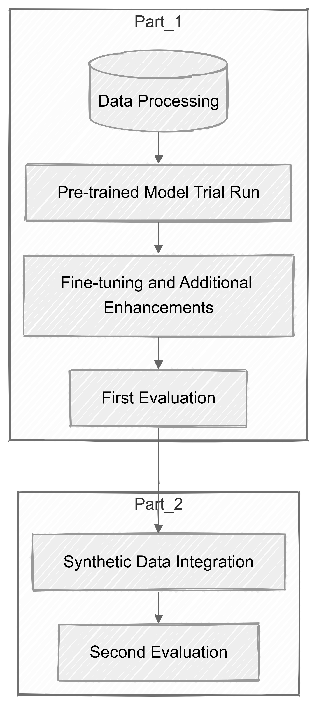
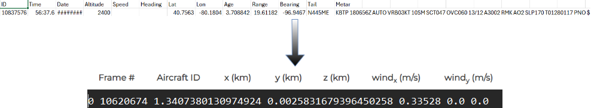
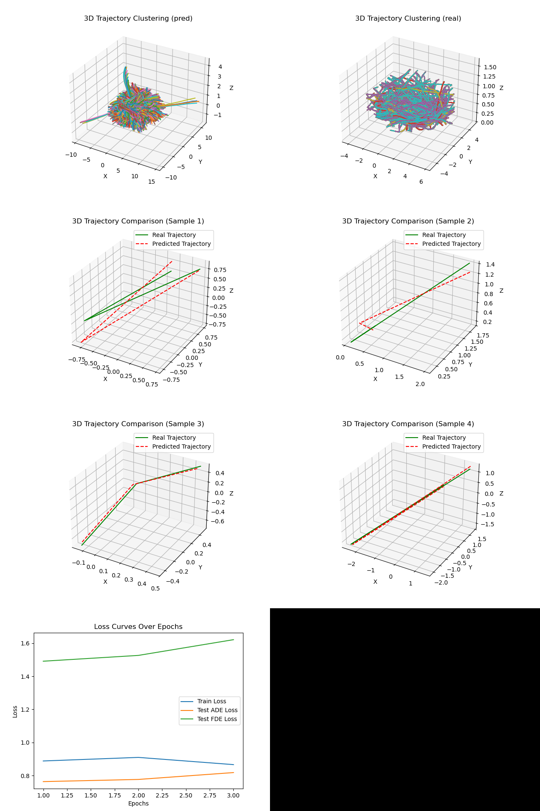
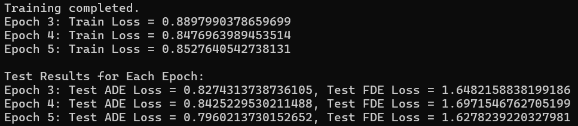

# aviation-trajectory-prediction
## Overview
This repository extends the pre-trained TrajAirNet model for general aviation trajectory prediction. The focus is on handling Out-of-Distribution (OOD) and Non-IID data using synthetic data augmentation and fine-tuning techniques. The dataset includes real-world flight trajectories, synthetic data, and OOD test data. The purpose of this project is to improve trajectory prediction for general aviation (GA) by addressing the limitations of existing models in handling unpredictable flight paths.



## Research Focus & Objectives
This project investigates general aviation trajectory prediction, focusing on:

- Out-of-Distribution (OOD) handling: Assessing how well the model generalizes to unseen flight trajectories.
- Non-IID Data Challenges: Addressing the high variability in real-world aviation data and ensuring balanced model performance across different flight patterns.
- Synthetic Data Augmentation: Using synthetic trajectories to fill gaps in training data and
evaluate their impact on generalization.

## Key Contributions
This project enhances trajectory prediction models, particularly for handling Out-of-Distribution (OOD) and non-IID data. The key contributions include:

- Fine-tuning a pre-trained model: The original TrajAirNet model was refined to improve its ability to capture the complexities of general aviation (GA) flight paths.
- Synthetic data integration: Manually augmented synthetic trajectories were incorporated into training to expose the model to diverse flight patterns and improve generalization.
- Uncertainty estimation: The Maximum Softmax Probability (MSP) technique was used to quantify model confidence, helping differentiate between in-distribution and OOD predictions.
- Visualization tools: 3D trajectory clustering, real vs. predicted trajectory comparisons, and loss curves were introduced to enhance interpretability.
- Hyperparameter tuning: Key parameters (e.g., batch size, kernel size, attention heads, and training epochs) were adjusted to balance performance and computational efficiency.



## Repository Structure
```
aviation-trajectory-prediction/
│   .gitignore
│   LICENSE
│   README.md
│   requirements.txt
│
├───Documents
│       47801873 Final Project.docx
│
├───sample_data
│   ├───OOD_test
│   ├───processed_dataset
│   ├───synthetic_data
│   ├───weather_data
│
├───src
│   │   check matches(OOD and indis).py
│   │   synthetic data pre-processing.py
│   │   test3.py
│   │   train3.py
│
├───model (Required Pre-trained Model Files)
│   │   trajairnet.py
│   │   utils.py
│   │   cvae_base.py
│   │   tcn_model.py
│   │   gat_model.py
│   │   gat_layers.py
```

### Setup Disclaimer
The provided setup below is only for showcase purposes and does not fully replicate the final results. The provided pipeline simplifies the setup process for demonstration. If you wish to exactly reproduce the final results, additional data handling and model tuning are required.  

## Required Files from the Original Repository
To train and test the model, download the following files from the original **TrajAirNet repository** and place them in the `src/` folder:

- `cvae_base.py`
- `gat_layers.py`
- `gat_model.py`
- `tcn_model.py`
- `trajairnet.py`
- `utils.py`

Download these files from the official repository: [TrajAirNet GitHub](https://github.com/castacks/trajairnet)  
After downloading, place them inside the `src/` directory.

## Setup Instructions
Due to the dataset size, this is just a sample trial to replicate and show the result.
1. Clone the repository
```
git clone https://github.com/TsungTseTu122/aviation-trajectory-prediction.git
cd aviation-trajectory-prediction
```

2. Install dependencies
```
pip install -r requirements.txt
```

3. Use the Provided Preprocessed Data
For convenience, we provide a fully preprocessed dataset to streamline replication.

4. Modify Paths in `train3.py` and `test3.py`
By default, `train3.py` assumes that datasets and the pre-trained model are stored in a specific directory used when working on local computer:
```
sys.path.append(os.path.join(os.getcwd(), 'C:/Users/Michael/Desktop/Y2 S2/DATA7903-Data Science Capstone Project 2B/dataset and pre-trained model/pre-trained model'))
```
Change this path to match your directory structure where the pre-trained model files (trajairnet.py, utils.py...) are stored.

Similarly, update the dataset paths:
```
parser.add_argument('--dataset_folder', type=str, default='C:/Users/Michael/Desktop/Y2 S2/DATA7903-Data Science Capstone Project 2B/dataset and pre-trained model/pre-trained model/dataset')
```
Modify this to:
```
parser.add_argument('--dataset_folder', type=str, default='./sample_data')
```
5. Run Training
```
python src/train3.py --dataset_folder ./sample_data
```
6. Run Testing

Ensure paths in `test3.py` are also updated similarly. Then, run:
```
python src/test3.py
```

### Explanation of Additional Scripts
While not required for this sample setup, the following scripts were used in earlier processing stages:

`synthetic data pre-processing.py`

This script was used to clean and preprocess the synthetic data, mainly to ensure it matched the format of real-world trajectory data.
The Z-axis (altitude) was manually added to the synthetic dataset by averaging the altitude of the full real-world dataset (due to the quality provided).

`check matches(OOD and indis).py`

This script was used to set the OOD dataset. We use aircrafts with different IDs to use them as OOD data to see how the model would respond.

## Results & Insights
- Baseline Model Performance: Initial results showed a drop in accuracy when tested on OOD data.
- Effect of Synthetic Data: Integrating synthetic data improved model robustness but also introduced some biases.
- Impact of Non-IID Data: Certain flight patterns were overrepresented, impacting generalization.
- Tradeoffs in Model Fine-Tuning: We observed diminishing returns when adding excessive synthetic data.



### Model Training and Testing Loss (Epochs 3 to 5)
Below are the training and test losses for epochs 3 to 5. The **ADE (Average Displacement Error)** and **FDE (Final Displacement Error)** are used to measure the trajectory prediction accuracy.  
A decreasing trend in **ADE loss** indicates improved prediction accuracy, while **FDE loss variation** suggests fluctuations in trajectory end-point prediction.



## Hyperparameter Adjustment

Users can freely modify the hyperparameters based on their own conditions and research objectives.

## Citation & Acknowledgment
- Original TrajAirNet Model: [GitHub Source](https://github.com/castacks/trajairnet)

- Preprocessing code for synthetic data was modified to address inconsistencies in the provided dataset.

## License

This project is licensed under the BSD 3-Clause License. See `LICENSE` for details.
